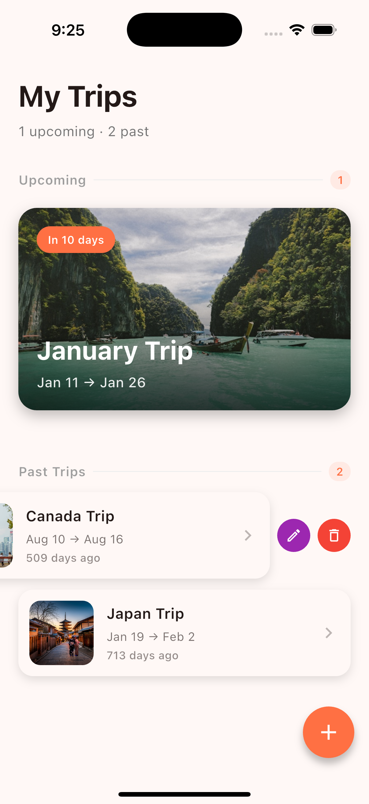
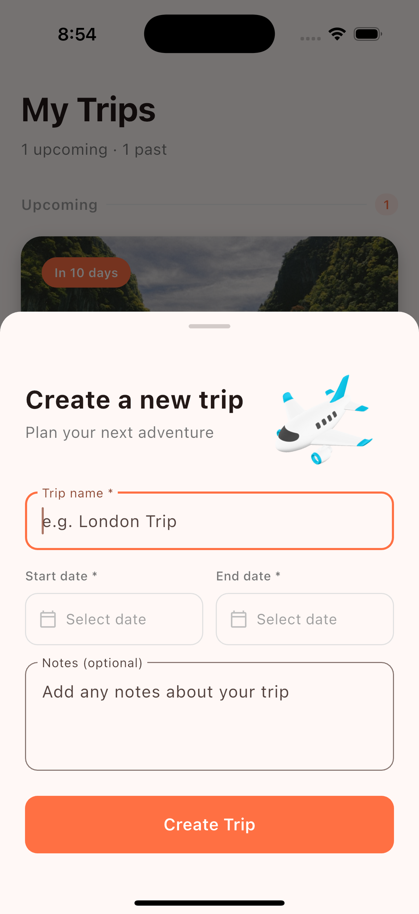
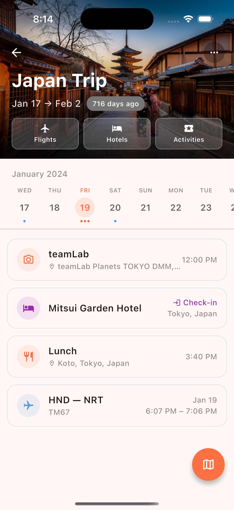
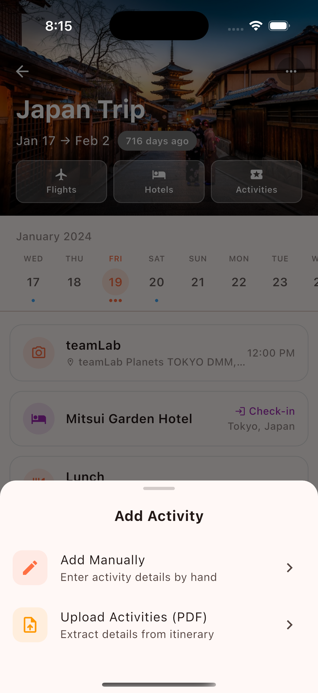
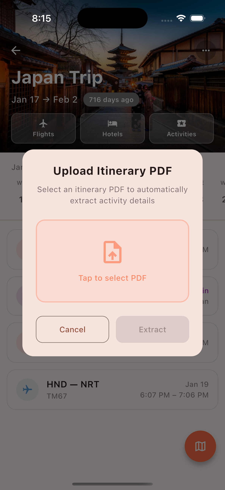
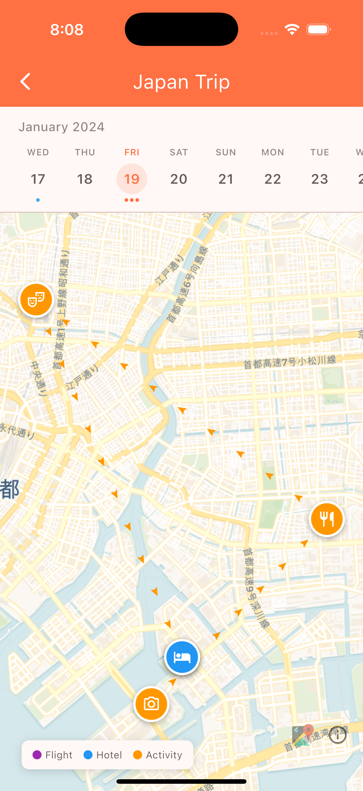

# Travel Organizer App

A travel itinerary organizer with a Flutter client and Convex backend.

## Features

- Upload PDFs and let AI automatically parse and extract flights, accommodations, or activities
- Manage trips with multiple destinations
- Track accommodations per destination
- Store flight details with full booking info
- Organize daily activities and itinerary
- Interactive map view with flutter_map (OpenStreetMap tiles)

## Screenshots

<p align="center">
  
  
  
</p>

<p align="center">
  
  
  
</p>

## Setup

### Prerequisites

- [Bun](https://bun.sh) installed
- [Flutter](https://flutter.dev) installed (for mobile client)
- [Rust](https://rustup.rs) installed (required by `convex_flutter` package)

### Installation

1. Install dependencies:

   ```bash
   bun install
   ```

2. Start Convex development server:

   ```bash
   bun run dev:convex
   ```

   This will prompt you to:
   - Log in with GitHub
   - Create a new Convex project
   - Sync your functions to the cloud

3. Your backend is ready! Convex provides real-time subscriptions out of the box.

### Flutter Client Setup

1. Set up shared environment files (symlinks client env to root):

   ```bash
   bun run setup:client
   ```

2. **Configure Google Places API Key** (required for address autocomplete and geocoding):

   Add your API key to `.env` or `.env.local` in the project root:

   ```
   GOOGLE_PLACES_API_KEY=your-actual-api-key-here
   ```

   To get an API key:
   - Go to [Google Cloud Console](https://console.cloud.google.com/apis/credentials)
   - Create a new API key
   - Enable these APIs: **Geocoding API**, **Places API**

3. **Configure Weather API Key** (optional, for hourly weather forecast):

   Add one of the following API keys to `.env` or `.env.local` in the project root:

   **Option A: OpenWeatherMap** (default)

   ```
   OPENWEATHERMAP_API_KEY=your-openweathermap-api-key
   ```

   - Sign up at [OpenWeatherMap](https://openweathermap.org/api)
   - Subscribe to the **One Call API 3.0** (free tier: 1000 calls/day)

   **Option B: Tomorrow.io**

   ```
   TOMORROWIO_API_KEY=your-tomorrowio-api-key
   ```

   - Sign up at [Tomorrow.io](https://www.tomorrow.io/weather-api/)
   - Free tier: 500 calls/day, 25/hour

4. Install Flutter dependencies:

   ```bash
   cd client
   flutter pub get
   ```

5. Run the app:

   ```bash
   flutter run
   ```

> **Note:** The client uses `convex_flutter` which requires Rust. Make sure your Rust toolchain is up to date: `rustup update stable`

## Map Features

This app uses [flutter_map](https://pub.dev/packages/flutter_map) with free OpenStreetMap/CARTO tiles — no Google Maps API key required for map display!

- **Light mode:** CARTO Voyager tiles
- **Dark mode:** CARTO Dark Matter tiles
- **Geocoding:** Uses Google Geocoding API (requires `GOOGLE_PLACES_API_KEY`)

## Convex Functions

| Module           | Functions                                                |
| ---------------- | -------------------------------------------------------- |
| `trips`          | `list`, `get`, `create`, `update`, `remove`              |
| `destinations`   | `listByTrip`, `get`, `create`, `update`, `remove`        |
| `accommodations` | `listByDestination`, `get`, `create`, `update`, `remove` |
| `flights`        | `listByTrip`, `get`, `create`, `update`, `remove`        |
| `activities`     | `listByTrip`, `get`, `create`, `update`, `remove`        |

## Scripts

| Script                 | Description                           |
| ---------------------- | ------------------------------------- |
| `bun run setup:client` | Set up client env symlinks (run once) |
| `bun run dev:convex`   | Start Convex dev server               |
| `bun run dev:client`   | Run Flutter client                    |

## Project Structure

```
travel-organizer-app/
├── client/                 # Flutter mobile app
├── server/
│   └── convex/            # Convex backend functions
│       ├── schema.ts      # Database schema
│       ├── trips.ts       # Trip functions
│       ├── destinations.ts
│       ├── accommodations.ts
│       ├── flights.ts
│       └── activities.ts
├── convex.json            # Convex configuration
└── package.json
```

## Troubleshooting

### Convex functions fail to sync

Ensure you're logged in:

```bash
bunx convex login
```

### Map markers not showing / Geocoding not working

This means the Google Places API key is missing or invalid:

1. Check that `.env` or `.env.local` has `GOOGLE_PLACES_API_KEY` set
2. Ensure the API key has these APIs enabled in Google Cloud Console:
   - Geocoding API
   - Places API
3. **Restart the app** (not hot reload) after changing env files

### "API key not found" errors

Check the Google Cloud Console to ensure:

- The API key is not restricted incorrectly
- Billing is enabled on the Google Cloud project
- The required APIs are enabled
